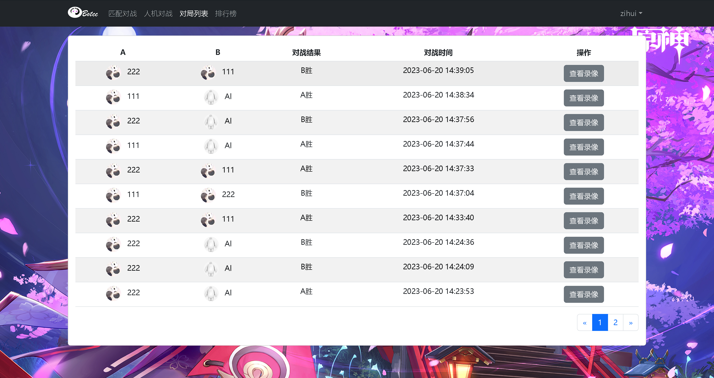

### Online-matching-games

main 分支是old，alp是默认分支。

使用 SpringBoot + SpringCloud + vue3 + MybatisPlus。

已经有以下几个功能：

1. 登录功能：

2. 注册功能：

3. 匹配对战：

   双方可以选择 Al 或 本人 出战。

   

4. 人机对战：

   有点小 bug, 实现思路有的问题。

   

   

5. 录像功能：

6. 排行榜功能：

7. 添加 Al 代码：

8. 删除 Al 代码：

9. 更新 Al 代码：

   7 8 9 就是简单的 crud。


### sql

新建 数据库 kob

```sql
create table bot
(
    id          int auto_increment
        primary key,
    user_id     int              not null,
    title       varchar(100)     null,
    description varchar(300)     null,
    content     varchar(10000)   null,
    rating      int default 1500 null,
    createtime  datetime         null,
    modifytime  datetime         null
);

create table record
(
    id         int auto_increment
        primary key,
    a_id       int           null,
    a_sx       int           null,
    a_sy       int           null,
    b_id       int           null,
    b_sx       int           null,
    b_sy       int           null,
    a_steps    varchar(1000) null,
    b_steps    varchar(1000) null,
    map        varchar(1000) null,
    loser      varchar(10)   null,
    createtime datetime      null
);

create table user
(
    id       int auto_increment
        primary key,
    username varchar(100)     null,
    password varchar(100)     null,
    photo    varchar(1000)    null,
    rating   int default 1500 null
);
```

