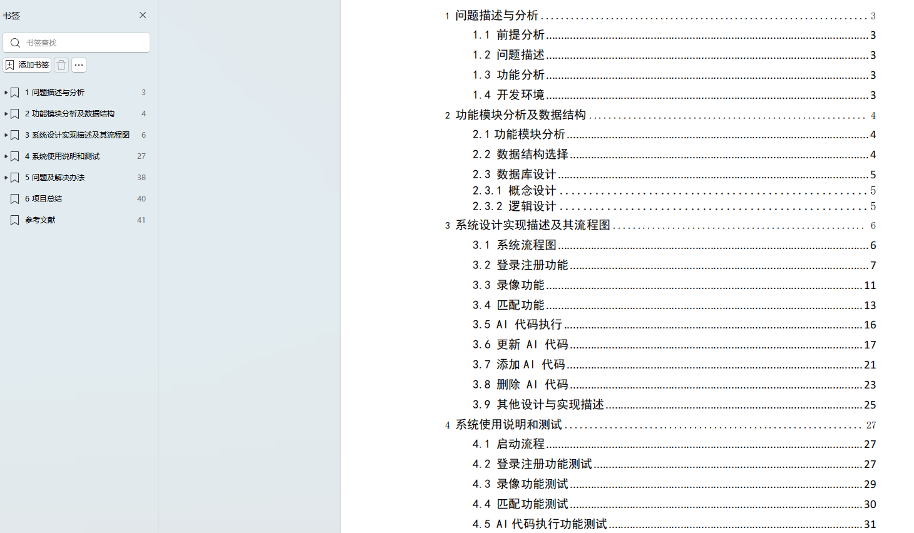
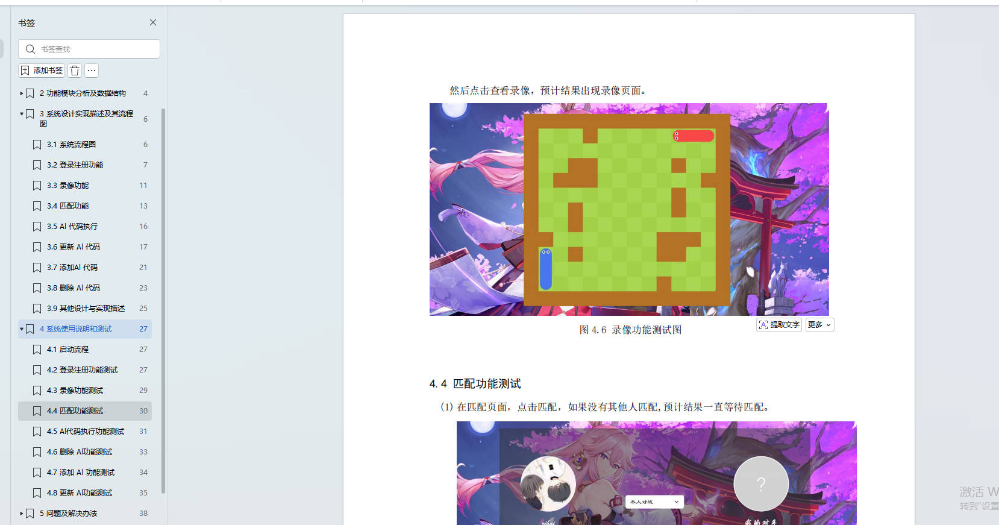

### Online-matching-games

使用 SpringBoot + SpringCloud + vue3 + MybatisPlus。

详细代码记录可以看 这个https://github.com/zihui7896/onlineWar

详细介绍可以看 详细说明.pdf

## 问题描述与分析	
### 前提分析	
### 问题描述	
### 功能分析	
### 开发环境	
## 功能模块分析及数据结构	
### 功能模块分析	
### 数据结构选择	
### 数据库设计	
#### 概念设计	
#### 逻辑设计	
## 系统设计实现描述及其流程图	
### 系统流程图	
### 登录注册功能	
### 录像功能	
### 匹配功能	
### Al 代码执行	
### 更新 Al 代码	
### 添加Al 代码	
### 删除 Al 代码	
### 其他设计与实现描述	
## 系统使用说明和测试	
### 启动流程	
### 登录注册功能测试	
### 录像功能测试	
### 匹配功能测试	
### Al代码执行功能测试	
### 删除 Al功能测试	
### 添加 Al 功能测试	
### 更新 Al功能测试	
## 问题及解决办法	
### JWT–token 如何解决跨域问题：	
### Java 是如何解析的 JSON 的:	
### Redis 是如何解决缓存：	
## 项目总结	

